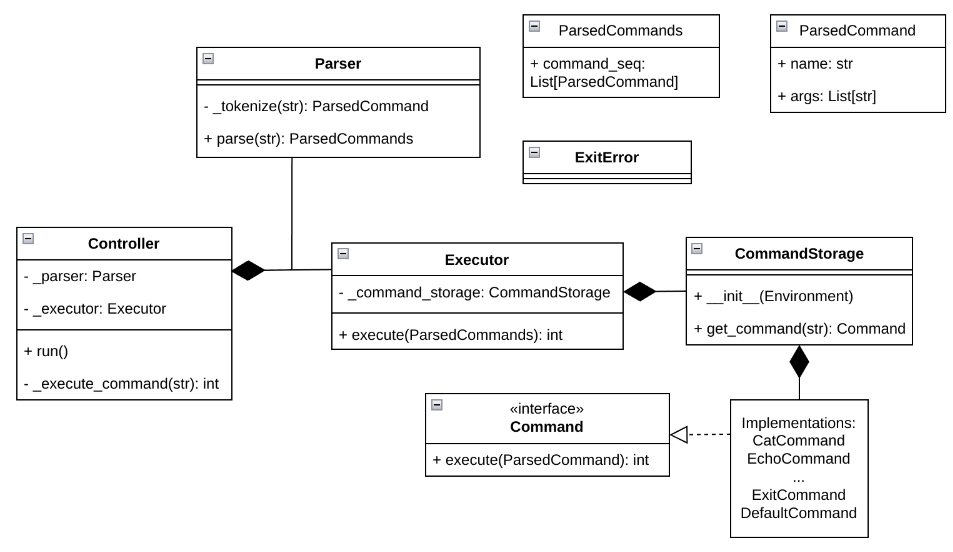

# Архитектура интерпретатора

`Controller` управляет основным циклом интерпретатора. Он запускает процесс обработки ввода, вызывает парсинг команд и их выполнение.

`Parser` разбирает входную строку на токены с помощью `shlex`, учитывая:

- Кавычки (одинарные/двойные) для группировки аргументов.

- Подстановку переменных окружения через `$` (например, `$FILE` заменяется на значение из `Environment`).

- Пайплайны (`|`), разделяя команды на последовательные этапы.

- Результат парсинга — список списков строк, где каждый список строк соответствует команде и ее аргументам (например, `[[ "echo", "arg1" ], [ "wc" ]]` для пайплайна).

`Executor` получает отпарсенные команды и выполняет их:

- Для встроенных команд (`cat`, `echo`, `wc`, `pwd`, `exit`) используются реализации интерфейса `Command`.

- Для внешних команд (`DefaultCommand`) создается отдельный процесс через `subprocess`.

- Для пайплайнов организует передачу вывода предыдущей команды на вход следующей (через системные каналы).

Environment хранит переменные (например, `FILE=example.txt`).
