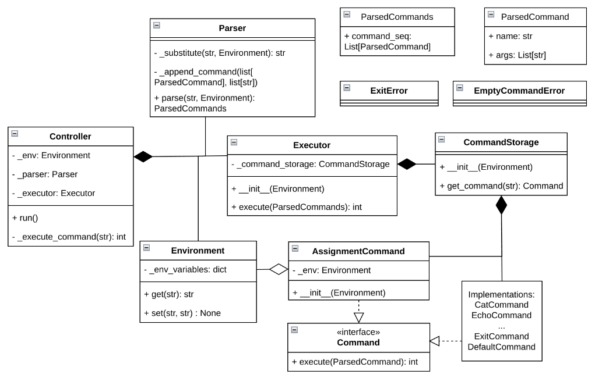

# Архитектура интерпретатора

### **Controller**

-   **Точка входа**:
    
    -   `run()`: Бесконечный цикл:
        
        1.  Чтение ввода пользователя.
            
        2.  **Парсинг**  через  `Parser.parse()`.
            
        3.  **Исполнение**  через  `Executor.execute()`.
            
    -   **Завершение**: При получении команды  `exit`  → прерывание цикла.
        

----------

### **Parser**

-   **Этапы парсинга**:

    1. **Подстановка переменных до токенизации**:
            
        -   Замена  `$VAR`  на значение из  `Environment.get("VAR")`  (например,  `$FILE`  →  `example.txt`).

    1.  **Разделение на подкоманды**  по  `|`  (например,  `cat $FILE | wc`  →  `["cat $FILE", "wc"]`).

    2.  **Обработка каждой подкоманды**:
                
        -   Токенизация через  `shlex.split()`

    -   **Результат**:  `ParsedCommands`, где каждый `ParsedCommand` — команда с аргументами.

----------

### **Environment**

-   **Хранение**:
    
    -   Словарь  `_env_variables`  для пар вида  `VAR=value`.
        
-   **Модификация**:
    
    -   Команды вида  `VAR=value`  → вызов  `set("VAR", "value")`.
        
    -   Переменные доступны для подстановки в последующих командах.
        

----------

### **Executor**

-   **Создание команд**:
    
    -   **Встроенные команды**  (cat, echo, wc, pwd, exit и другие):
        
        -   `CommandStorage` возвращает объекты классов, реализующих  `Command`  (например,  `EchoCommand(args)`).
            
    -   **Внешние команды**:
        
        -   `DefaultCommand`: создается отдельный процесс через subprocess.

    - **Присваивание**

        -   Команда присваивания реализуется в классе `AssignmentCommand`.

-   **Пайплайны**:
    
    -   **Связь команд**:  `stdout`  предыдущей команды →  `stdin`  следующей (через  `os.pipe()`).
        
    -   **Коды возврата**: Сохраняются для последней команды.

    -   Команды, разделенные пайпами, выполняются последовательно.
        
-   **Аргументы vs входной поток**:
    
    -   **Аргументы**: Параметры, переданные в команде (например,  `cat file.txt`  →  `file.txt`).
        
    -   **Входной поток**: Данные, переданные через пайп (например,  `echo 123 | wc`  →  `wc`  читает  `123`  из  `stdin`).

----------

### **Ключевые детали**

-   **Объектное представление**: Результат парсинга — `ParsedCommands`, состоящая из списка `ParsedCommand` - названий команд и их аргументов.
    
-   **Внешние процессы**:
    
    -   `DefaultCommand`  запускает процесс "как есть" (например,  `git status`  → напрямую через ОС).
        
-   **Обработка ошибок**:
    
    -   Несуществующие файлы → вывод сообщения в  `stderr`.
        
    -   Некорректный синтаксис → ошибка парсинга.
        
-   **Завершение работы**:
    
    -   При получении `ExitException` в контроллере завершение работы интерпретатора.

----------

### **Процесс работы системы.**

**В цикле:**

1. **Controller**  считывает введенную пользовтелем команду и запускает обработку.
    
2.  **Парсер**  разбирает строку:
    
    -   Заменяет переменные (`$VAR`  → их значения).

    -   Разбивает на аргументы с помощью библиотеки `shlex` 

    -   Разделяет команды.
        
3.  **Controller**  передает команду  **Executor**.
    
4.  **Executor**  выполняет команду:

    - Для каждой команды из последовательности:

        - Создает (если нужно) пайпы.

        - С помощью `_command_storage.get_command()` получает обработчик, реализующий интерфейс `Command`

        - У этого обработчика вызывается метод `execute`
        
            -   Если это встроенная команда (например,  `echo`) → вызывает соответствующий обработчик.

            - Если это `exit`  →  выкидывается исключение `ExitException`, которое ловит `Controller` и завершает программу.
                
            -   Если это внешняя команда (например,  `git`) → запускает ее как отдельный процесс.
        
        - Результат метода `execute` - код возврата.

5. **Обработка ошибок**

    - Все ошибки ловятся в главном цикле, не давая шеллу упасть из-за пользовательского ввода.
    

